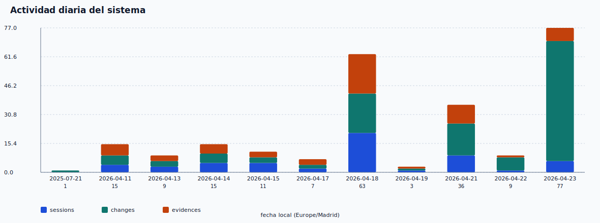
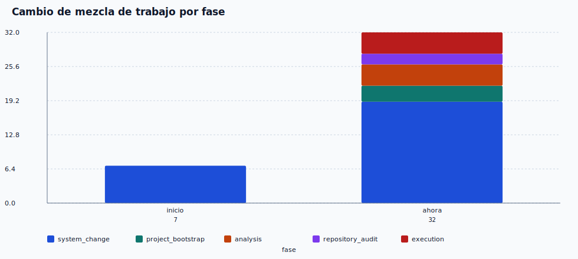
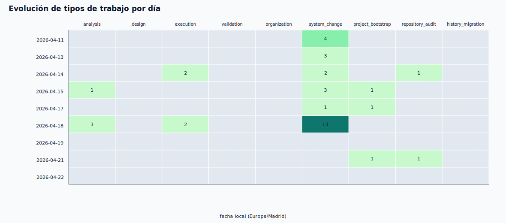
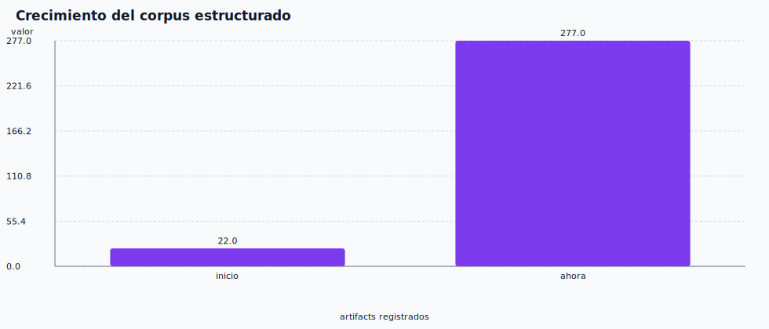
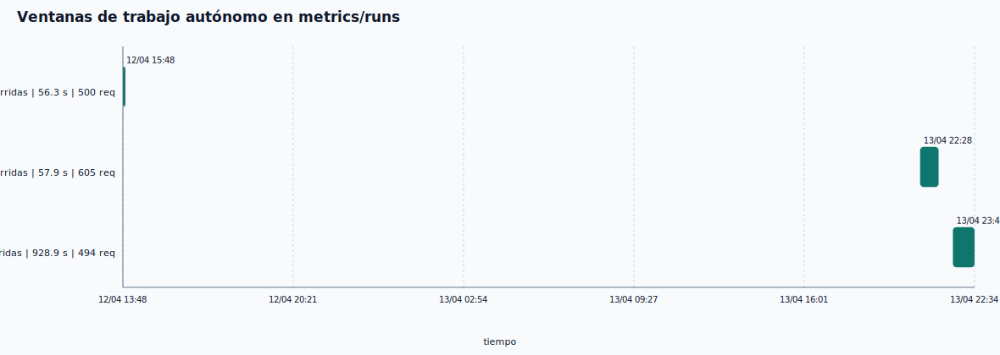
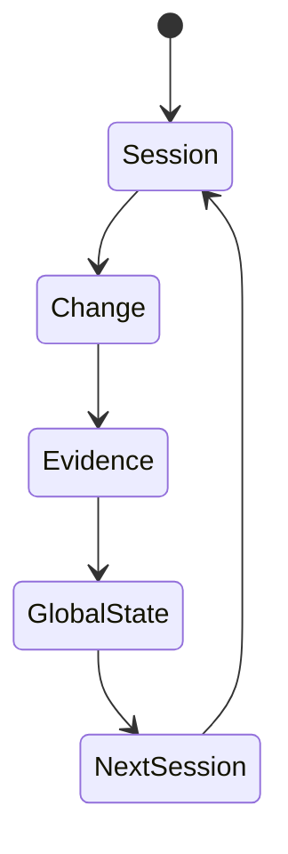

# Evolución del sistema BAGO

Este informe compara la fase inicial de corrección y migración con el estado operativo actual del repositorio.

## Fuentes

- [state/metrics/metrics_snapshot.json](/Users/INTELIA_Manager/Documents/INTELIA_Manager_2026/Contabilidad/TPV_Contabilidad%202/.bago/state/metrics/metrics_snapshot.json)
- [state/global_state.json](/Users/INTELIA_Manager/Documents/INTELIA_Manager_2026/Contabilidad/TPV_Contabilidad%202/.bago/state/global_state.json)
- [state/sessions/](/Users/INTELIA_Manager/Documents/INTELIA_Manager_2026/Contabilidad/TPV_Contabilidad%202/.bago/state/sessions)
- [state/changes/](/Users/INTELIA_Manager/Documents/INTELIA_Manager_2026/Contabilidad/TPV_Contabilidad%202/.bago/state/changes)
- [state/evidences/](/Users/INTELIA_Manager/Documents/INTELIA_Manager_2026/Contabilidad/TPV_Contabilidad%202/.bago/state/evidences)
- [state/metrics/runs/](/Users/INTELIA_Manager/Documents/INTELIA_Manager_2026/Contabilidad/TPV_Contabilidad%202/.bago/state/metrics/runs)

## Lectura ejecutiva

Al principio, BAGO trabajaba como un sistema de corrección y preservación canónica:

- centrado en `system_change`,
- con roles amplios y generales,
- con prioridad en migración, validación y consolidación documental,
- y con poca variedad de tipos de tarea.

Ahora trabaja como un sistema operativo más maduro:

- tiene `project_bootstrap`, `analysis`, `repository_audit` y `execution` además de `system_change`,
- separa mejor los roles por función,
- conserva trazabilidad de cambio, evidencia y estado,
- y ejecuta corridas autónomas de stress con ventanas temporales medibles.

## Métricas comparativas

| Métrica | Inicio | Ahora |
| --- | ---:| ---:|
| Snapshot documental mínimo | 22 artefactos | 256 artefactos |
| Sesiones nativas visibles | 19 | 57 |
| Sesiones migradas preservadas | 3 | 4 preservadas en `state/migrated_sessions/` |
| Cambios migrados/validados | 0 | 139 |
| Evidencias registradas | no consolidado en snapshot inicial | 60 |
| Integridad del pack | GO | GO / GO / GO |

## Métricas de hoy

Hoy local: **23/04/2026**.

| Métrica | Valor |
| --- | ---: |
| Sesiones de hoy | 6 |
| Cambios de hoy | 64 |
| Evidencias de hoy | 7 |
| Corridas autónomas de hoy | 0 |
| Solicitudes de hoy en `metrics/runs` | 0 |

Si hoy no aparece actividad, significa que el árbol visible no contiene registros fechados en el día local del entorno.

## Cómo trabajaba al principio

Rango base del arranque: **11/04/2026**.

- La sesión dominante era `system_change`.
- El trabajo giraba alrededor de corrección del pack, migración histórica y oficialización canónica.
- La mezcla de roles era más generalista:
  - `role_architect, role_canonical_auditor, role_generator, role_master_bago, role_orchestrator, role_organizer, role_validator, role_vertice`
- La actividad se concentró en pocas ventanas de alta densidad documental.

## Cómo trabaja ahora

Rango visible del estado actual: **14/04/2026-15/04/2026** en el árbol local, con `global_state.json` actualizado al **17/04/2026 19:35 UTC**.

- La sesión incluye tareas más especializadas.
- La mezcla de trabajo se diversifica:
  - `role_adaptador_proyecto, role_architect, role_auditor, role_canonical_auditor, role_dev, role_developer, role_executor, role_generator, role_iniciador_maestro, role_master_bago, role_orchestrator, role_organizer, role_validator, role_vertice`
- El sistema ya no solo corrige canon:
  - arranca repo,
  - audita,
  - ejecuta,
  - evalúa,
  - reconstruye,
  - y consolida.

## Actividad por día

## Cambio de mezcla de trabajo

| Fase | system_change | project_bootstrap | analysis | repository_audit | execution | Total |
| --- | ---:| ---:| ---:| ---:| ---:| ---:|
| Inicio | 7 | 0 | 0 | 0 | 0 | 7 |
| Ahora | 19 | 3 | 4 | 2 | 6 | 50 |

## Evolución de tipos de trabajo

## Crecimiento del corpus

## Ventanas de trabajo autónomo

Las corridas de `state/metrics/runs/` sí traen duración real y permiten medir trabajo autónomo continuo.

| Bloque | Inicio local | Fin local | Duración activa | Solicitudes | Corridas |
| --- | --- | --- | ---:| ---:| ---:|
| bloque 1 | 12/04 15:48 | 12/04 15:49 | 56.318s | 500 | 2 |
| bloque 2 | 13/04 22:28 | 13/04 23:11 | 57.897s | 605 | 7 |
| bloque 3 | 13/04 23:44 | 14/04 00:34 | 928.868s | 494 | 8 |

## Diagramas

### Evolución funcional

### Ciclo autónomo

## Observaciones

- **Snapshot:** 23/04/2026 · versión 3.0 · estado del sistema: `stable`.
- **Corpus total:** 57 sesiones · 139 cambios · 60 evidencias.
- **Suite de tests:** `pass` · 144 workers registrados.
- **Últimos cambios aplicados:**
  - debt_ledger --json rc=0 sin scans; tests debt+risk JSON; 130/130
  - Tests findings_engine:parse y sync_badges:compute; 128/128 tests
  - Coverage por módulo en dashboard (118/139 = 84%)
  - test_scan_purge; dashboard timeouts 60s; smoke_runner show_last rc=0
  - Observaciones dinamicas en reporte de evolucion + 2 FALLBACK_IDEAS
- La evolución del sistema es de especialización progresiva: cada sprint aumenta la capacidad de auto-gobernanza y cierre de ciclos con evidencias.
