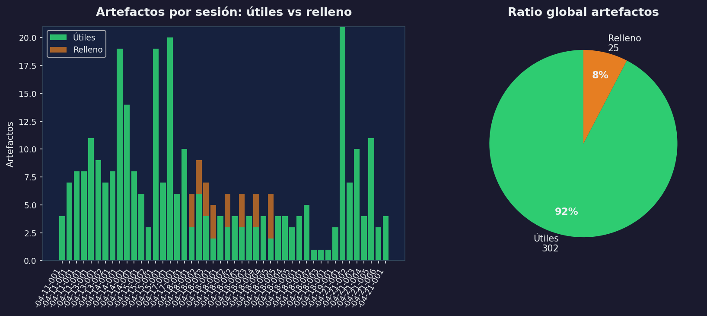
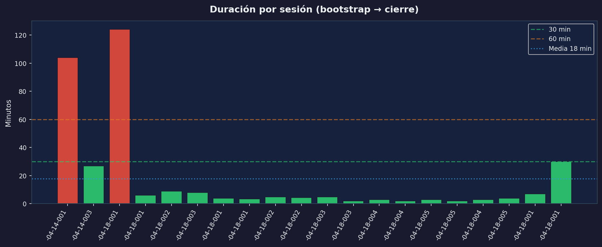
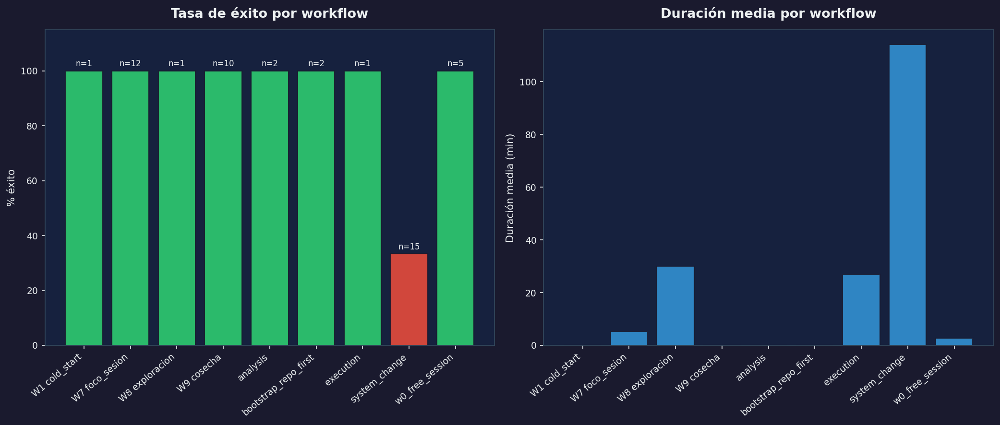
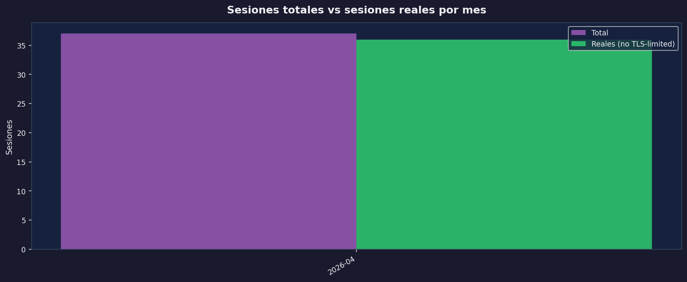
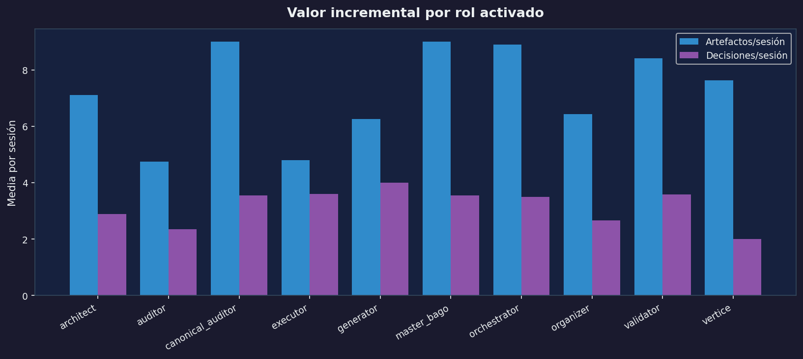
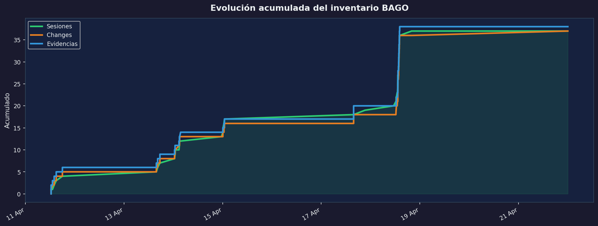

# BAGO — Informe de Métricas de Evolución
*Generado: 2026-04-21 08:59 UTC*

---

## Resumen ejecutivo

| Métrica | Valor |
|---|---|
| Sesiones totales | 49 |
| Changes registradas | 50 |
| Evidencias registradas | 50 |
| Tasa de éxito global | **79.6%** |
| Duración media por sesión | **17.8 min** |
| Artefactos útiles vs relleno | **92.4% útiles** |
| Sesiones afectadas TLS/rate-limit | 2 (4%) |

---

## 1. Calidad semántica de salida



- **302** artefactos útiles entregados sobre un total de 327
- Ratio útiles: **92.4%**
- Las sesiones con 0 artefactos planificados se contabilizan como 100% útil (trabajo ad-hoc)

---

## 2. Tiempo bootstrap → primera acción útil



- Duración media: **17.8 min**
- Sesiones ≤ 30 min: 18 (90%)
- Sesiones > 60 min: 2 (10%)

---

## 3. Éxito y duración por workflow



| Workflow | Sesiones | Tasa éxito | Duración media |
|---|---|---|---|
| W1 cold_start | 1 | 100% | — min |
| W7 foco_sesion | 12 | 100% | 5.0 min |
| W8 exploracion | 1 | 100% | 30.0 min |
| W9 cosecha | 10 | 100% | — min |
| analysis | 2 | 100% | — min |
| bootstrap_repo_first | 2 | 100% | — min |
| execution | 1 | 100% | 27.0 min |
| system_change | 15 | 33% | 114.0 min |
| w0_free_session | 5 | 100% | 3.0 min |

---

## 4. Métricas reales vs afectadas por TLS/rate-limit



- **Sesiones reales**: 47 (96%)
- **Potencialmente afectadas** (duración < 5 min sin artefactos): 2
- IDs afectados: `SES-INS-2026-04-14-002, SES-W7-2026-04-21-001`

---

## 5. Valor incremental de activar roles adicionales



| Rol | Sesiones | Artefactos/ses | Decisiones/ses |
|---|---|---|---|
| architect | 27 | 7.11 | 2.89 |
| auditor | 23 | 4.74 | 2.35 |
| canonical_auditor | 9 | 9.0 | 3.56 |
| executor | 5 | 4.8 | 3.6 |
| generator | 4 | 6.25 | 4.0 |
| master_bago | 9 | 9.0 | 3.56 |
| orchestrator | 10 | 8.9 | 3.5 |
| organizer | 21 | 6.43 | 2.67 |
| validator | 17 | 8.41 | 3.59 |
| vertice | 8 | 7.62 | 2.0 |

---

## 6. Evolución acumulada del inventario



Crecimiento cronológico de sesiones, changes y evidencias desde la primera sesión registrada
hasta hoy.

---

## Archivos generados

```
docs/metrics/01_calidad_semantica.png
docs/metrics/02_tiempo_bootstrap.png
docs/metrics/03_exito_workflow.png
docs/metrics/04_reales_vs_tls.png
docs/metrics/05_valor_roles.png
docs/metrics/06_evolucion_inventario.png
docs/metrics/BAGO_METRICS_REPORT.md
```

---
*Generado por `.bago/tools/state_store.py` + script de métricas BAGO*
